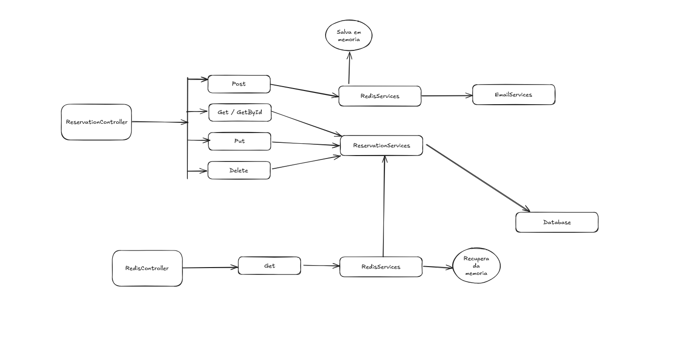

# Microserviço de Reserva de Restaurante

Este é um microserviço desenvolvido em **.NET** e **C#** para gerenciar reservas de restaurante. Ele utiliza **MongoDB** como banco de dados principal e **Redis** para armazenamento em cache temporário das reservas.

---

## 📖 Funcionalidades

- **Cadastro de Reservas**: Armazena a reserva temporariamente no Redis.
- **Confirmação de Reservas**: Apenas reservas confirmadas são salvas no MongoDB.
- **Expiração Automática**: Reservas não confirmadas são removidas do Redis após 1 hora.
- **Cache em Redis**: Armazena reservas temporárias.
- **Envio de Emails**: Notificação para confirmar a reserva

---

## 🛠️ Tecnologias Utilizadas

- **.NET** e **C#**: Linguagem de programação e framework principal.
- **MongoDB**: Banco de dados NoSQL para armazenar dados de reservas confirmadas.
- **Redis**: Sistema de cache para armazenar reservas temporárias.
- **Docker** (opcional): Para contêinerização das dependências.

---

## ⚙️ Estrutura do Projeto

### Controllers

- **ReservationController**: Controla as operações de criação, leitura, atualização e exclusão de reservas.
- **RedisController**: Gerencia o acesso ao cache Redis.

### Services

- **RedisServices**: Manipula as operações de cache, como salvar e recuperar reservas temporárias.
- **ReservationServices**: Contém a lógica de negócio para gerenciar as reservas.
- **EmailServices**:  Envia notificações de confirmação
### Banco de Dados

- **MongoDB**: 
  - Armazena apenas reservas confirmadas.
  - Contém informações completas de cada reserva.

- **Redis**:
  - Armazena temporariamente reservas não confirmadas.
  - Remove automaticamente reservas expiradas após 1 hora.

---

## 🗂️ Fluxo de Operações


---

## 🚀 Como Executar

### Pré-requisitos

- **.NET SDK** instalado.
- **MongoDB** e **Redis** em execução (pode ser configurado com Docker).
- Configuração das strings de conexão no arquivo `appsettings.json`.

### Passos

1. Clone o repositório:
   ```bash
   git clone https://github.com/seu-repositorio/microservico-reserva.git
   ```
2.  Navegue até a pasta do projeto:
	```bash
	cd microservico-reserva
	```
3. Execute a aplicação
	```bash
	dotnet clean
	dotnet run
	```

## 🔧 Configuração do Redis e MongoDB

### Redis

Certifique-se de que o Redis está em execução na porta padrão (6379). Se estiver utilizando Docker:
	```bash
	docker run -d --name redis -p 6379:6379 redis
	```

### MongoDB

Certifique-se de que o MongoDB está em execução. Utilize o docker-compose.
	```bash
	docker-compose up
	```

## 📝 Licença

Este projeto está licenciado sob a MIT License.
